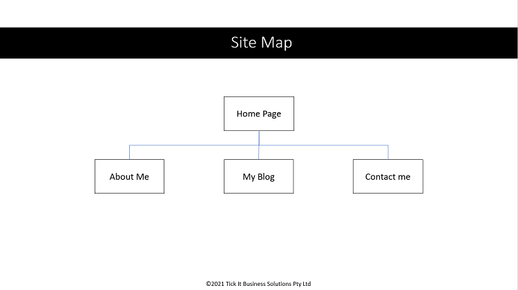
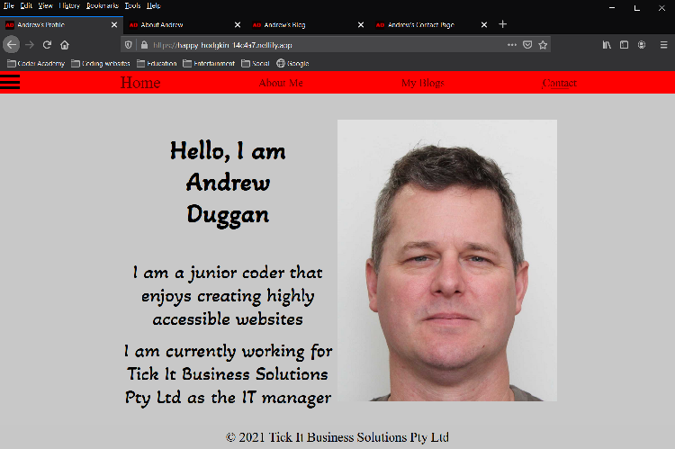
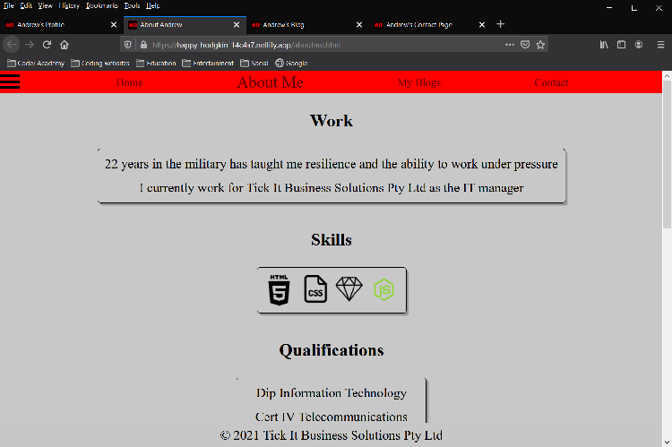
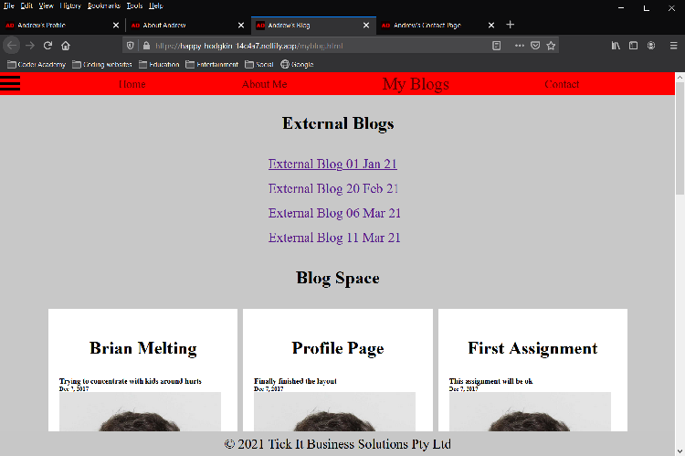
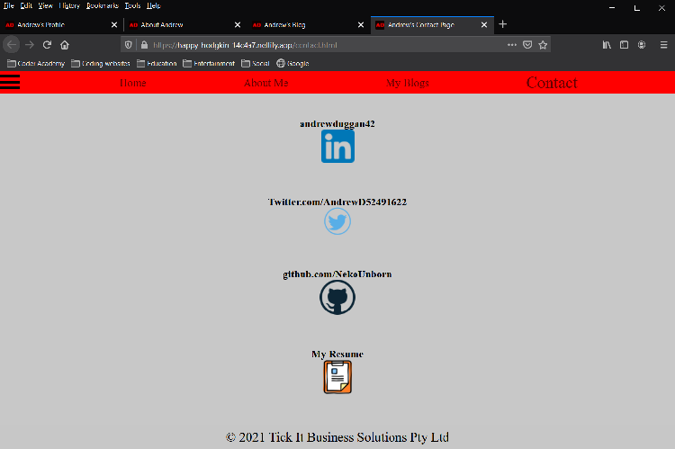

***Link to published portfolio website***

https://happy-hodgkin-14c4a7.netlify.app

***Description of portfolio website***:

**-- purpose**

The aim of this website is to act as an online CV to prospective clients and employers

**-- Functionality / features**

-The website consists of multiple emenents to conform with Screen Reader requirements.
-The active links pulse when hovered over to catch the eye and indicate that they can be clicked on.
-The content shifts position depending on the size of the screen
-The hamburger rotates on hover in preparation for the addition of JAVASCRIPT collapsable menu.

**-- Sitemap**

**-- Screenshots**

**-- Target audience**

    prospective clients / employers

**-- Tech stack**

    html css